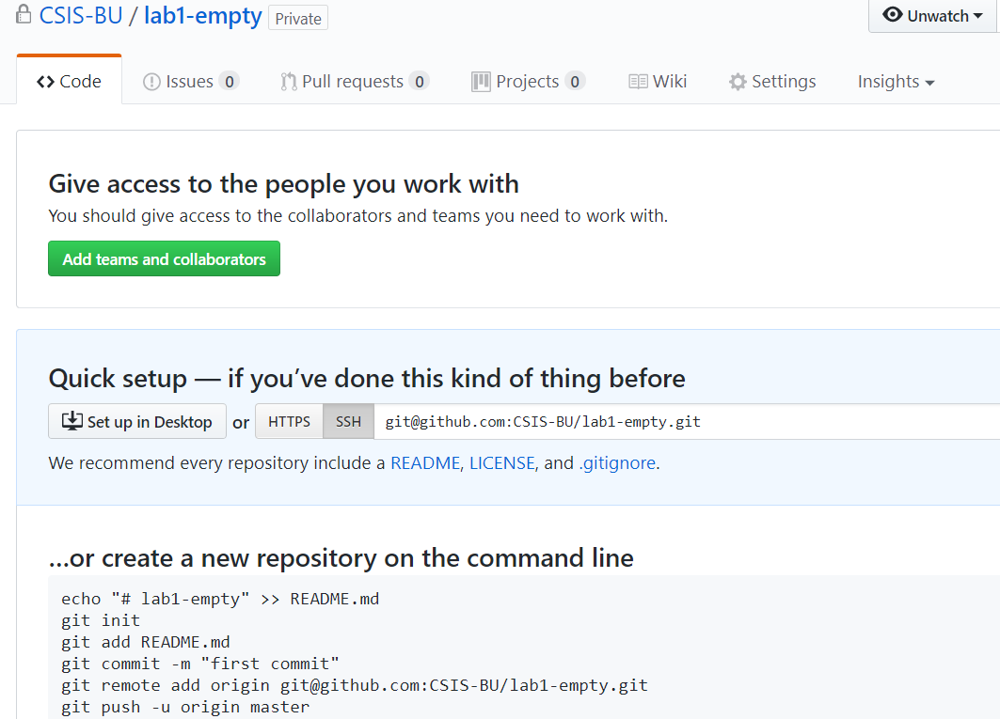

# CS 210, Lab 1 -- When the remote repository is initially empty

1. In your repository, your will see an initial page with instructions (all command prompts).

    

1. Open up a command prompt or **Git CMD** (Windows) App.

    * Change directory from "C:\Users\[your login ID]" to "C:\Users\[your login ID]\Desktop"

    **cd Desktop**

1. You now enter the following commands under command prompt to create a new file Lab1.txt.

   **echo "# CS 210, FA 17, Lab 1, [Your Name], [Your E-mail Address]" >> Lab1.txt**

1. Initialize the **local** Git repository.

   **git init**

1. Check the status of the Git repository.

    **git status**

1. As the Lab1.txt files is untracked, we need to track it before taking the snapshot of the new/deleted/modified files/directories.

   **git add Lab1.txt**

1. Now, we're ready to take a snapshot of what we got in the repo.

   **git commit -m "CS 210 Lab 1"**

1. Set up the corresponding remote repository. The SSH way.

   **git remote add origin git@github.com:CSIS-BU/cs210-fa17-lab1-[YOUR ID].git**
   
   * Note: Here, you are set up to use SSH to connect to the repository. Thus, you'll have to follow the instructions provided in this URL [Help, I keep getting a 'Permission Denied (publickey)' error when I push!](https://gist.github.com/adamjohnson/5682757) and set up the SSH key for the access.
   
   * Note: Another way to do it is through HTTPS. That is, instead of adding the remote repository info through the command above, you can execute the following command:
   
   **git remote add origin https://github.com/CSIS-BU/cs210-fa17-lab1-[YOUR ID].git**

   * Be careful about the step above. The [YOUR ID] part should match what you get under GitHub

1. Once you set up the remote repository in either SSH or HTTPS way, you may now push the snapshot in the local repository to the remote (GitHub) one.

   **git push -u origin master**

1. Now login to your GitHub page and see if your repository does include the **Lab1.txt** file.

   If not, please try again or contact the instructor for help.
